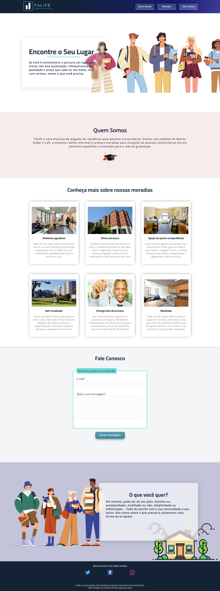

# 4LIFE - Moradias Universitárias

Esta é uma solução para o desafio do Projeto Desenvolve - O Boticário proposto pela Alura.

## Índice

- [Visão Geral](#overview)
  - [O Desafio](#the-challenge)
  - [Screenshot](#screenshot)
  - [Links](#links)
- [Meu processo](#my-process)
  - [Construído com](#built-with)
  - [O que eu aprendi](#what-i-learned)
- [Autora](#author)


## Visão Geral

### O Desafio

Os requisitos são:

- Criar uma página que chame a atenção de pessoas que estão na graduação e ofereça os produtos <b>"moradia compartilhada" e "kitnets"</b>.

- Ela deve apresentar informações sobre a empresa e seus produtos.

- Seguir a semântica do <b>HTML 5</b>.

- Possuir ícones para as redes sociais da empresa: <b>Twitter, Facebook e Instagram</b>, Estas páginas devem ser abertas em uma nova aba.

- Seguir uma paleta de cores baseada na logomarca provida pelo cliente.

- Conter cabeçalho, rodapé, uma seção <b>Quem Somos</b> e uma seção <b>Fale conosco</b>.

- Seção "Fale Conosco": 

-  Essa seção deve conter um formulário para contato, incluindo: <b>Um campo de email, Um campo de texto para a mensagem, Um botão de envio</b>.

- O formulário deve conter uma validação específica que deve ser atendida antes de ser enviado.

- Caso preenchido corretamente, deve ser exibida a mensagem "Obrigado pelo contato, <b>user</b>!", levando em consideração o formato de e-maio como: <b>user</b>@<b>domain</b>.com.

  

### Screenshot




### Links

- URL da solução: [Acesse o desafio publicado](https://desafio-desenvolve.netlify.app/)


## Meu processo

### Construído com

- HTML5

- CSS

- Flexbox

- Media Queries

- JavaScript

- Testes de Acessibilidade

  

### O que eu aprendi

Usei o desafio para desenvolver e aprimorar meus conhecimentos em construções de Landing Pages. Particularmente, gostei de entender melhor e praticar o armazenamento de informações no <b>Localstorage</b>.

```css
<script>
	let showName = document.getElementById("showName");
    showName.innerHTML = localStorage.getItem("userName");
</script>
```


## Autora 

- Linkedin - [Dani Michely](https://www.linkedin.com/in/dani-michely/)

- GitHub - [Dani Michely dev](https://github.com/danimichelydev)

- <script>
          let showName = document.getElementById("showName");
          showName.innerHTML = localStorage.getItem("userName");
        </script>

- <script>
          let showName = document.getElementById("showName");
          showName.innerHTML = localStorage.getItem("userName");
        </script>

- 

  

